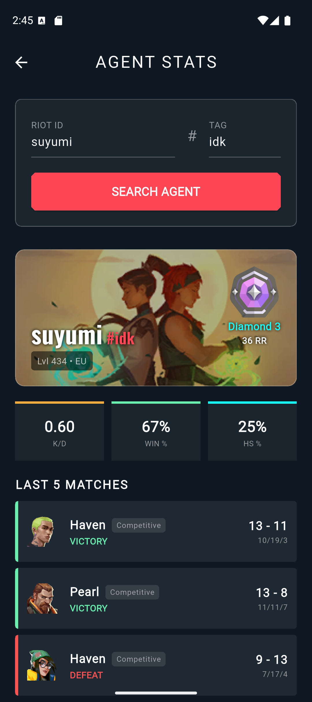

# 🎯 ValBoard

Valorant oyuncuları için geliştirilmiş kapsamlı taktik tahtası ve istatistik takip uygulaması.


## 📱 Ekran Görüntüleri

| Ana Menü | Taktik Tahtası | Ajan İstatistikleri |
|:---:|:---:|:---:|
|  |  |  |

## 🔥 Özellikler

* **Taktik Tahtası:** Güncel haritalar üzerinde çizim ve strateji planlama.
* **Akıllı Yerleşim:** Ajanları ve yetenekleri (ValoPlant tarzı AOE ile) haritaya sürükle-bırak.
* **2026 Kadrosu:** Tejo, Waylay ve Veto dahil en yeni ajanlar.
* **Oyuncu Analizi:** Riot ID ile Rank, MMR, K/D ve maç geçmişi sorgulama.
* **HenrikDev API:** Gerçek zamanlı veri akışı.

## 🛠️ Kurulum

Projeyi çalıştırmak için terminale şu komutları girin:

```bash
git clone [https://github.com/ByMebsa/ValBoard.git](https://github.com/ByMebsa/ValBoard.git)
cd ValBoard
flutter pub get
flutter run